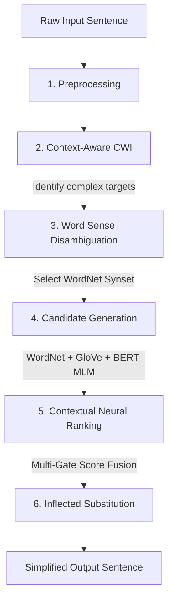

# Context-Aware Hybrid Neural Lexical Simplifier

A production-ready, 6-stage Lexical Simplification system utilizing BERT contextual embeddings, Masked Language Modeling (MLM), WordNet semantic gating, and GloVe vector spaces. This engine dynamically simplifies complex words in English sentences without relying on static dataset lookups.

---

## 1. System Pipeline Architecture

The system operates as a hybrid modular pipeline running through 6 logical stages:



### The 6 Stages Explained:
1. **Preprocessing (`preprocessing.py`)**: Tokenizes the raw sentence using spaCy (`en_core_web_sm`), performs POS tagging, lemmatization, and marks non-content functional tags (determiners, pronouns, prepositions, punctuation) to ignore.
2. **Context-Aware Complex Word Identification (`contextual_cwi.py`)**: Assesses word complexity using a combination of **BERT Surprisal** (negative log probability at a masked position), **Zipf frequency** (via `wordfreq`), **familiarity word lists** (Dale-Chall, Oxford 3000), and **morphological features** (syllables, length).
3. **Word Sense Disambiguation (`word_sense_disambiguation.py`)**: Disambiguates the sense of identified complex words by finding the WordNet synset whose example sentences/definitions have the highest BERT embedding similarity with the target word's context.
4. **Candidate Generation & Gating (`candidate_generator.py`)**: Generates synonym candidates from WordNet synsets and GloVe vector neighborhoods, filtered by target POS and semantic closeness to guarantee they are semantically related (hypernyms, hyponyms, or sisters).
5. **Contextual Neural Ranking (`model.py` / `train.py`)**: Ranks candidates using a PyTorch neural ranker. Features include sentence-level contextual embeddings, local MLM fit probability, static cosine distance, and simplicity deltas. A dual-gate mechanism combines semantic and simplicity sub-scores:
   $$\text{Final Score} = \text{Semantic Fit} \times \text{Simplicity Fit}$$
6. **Word Substitution & Inflection (`inference.py`)**: Replaces target terms sequentially (sorting left-to-right to maintain index alignment using `offset_shift`). The candidate word is inflected to match the tense, number (plural/singular), and capitalization of the original word.

---

## 2. Directory Structure

Following directory clean-up, the workspace is organized as follows:

```
├── config.py                     # Centralized pipeline thresholds and configurations
├── preprocessing.py              # NLP preprocessing (spaCy)
├── contextual_cwi.py             # Context-aware Complex Word Identification
├── word_sense_disambiguation.py  # WordNet-based WSD using BERT embeddings
├── candidate_generator.py        # Candidate generation & semantic gating
├── model.py                      # PyTorch Neural Ranker network definition
├── dataset.py                    # PyTorch dataset for BenchLS/synthetic parsing
├── inference.py                  # End-to-end command-line inference engine
├── train.py                      # Training script for modular setup
├── train_local.py                # CPU-optimized training pipeline and local runner
├── test.py                       # Master verification test suite (8/8 tests)
│
├── best_model.pt                 # Trained PyTorch neural ranking weights
├── BenchLS.txt                   # BenchLS lexical simplification dataset
├── BenchLS_README.txt            # BenchLS dataset metadata
├── dale_chall.txt                # Dale-Chall easy word list
├── oxford3000.txt                # Oxford 3000 familiar word list
├── requirements.txt              # Pipeline package dependencies
└── README.md                     # This file
```

---

## 3. Getting Started

### Installation
Install python dependencies:
```bash
pip install -r requirements.txt
```

Ensure spaCy model and NLTK data are downloaded:
```bash
python -c "import nltk; nltk.download('wordnet')"
python -m spacy download en_core_web_sm
```

### Running the Test Suite
Run the 8-stage verification test suite to check pipeline alignment:
```bash
python test.py
```

### Running Inference
Run the interactive console simplifies pipeline:
```bash
python inference.py
```
*Input sample sentence when prompted, and the console will print a detailed stage-by-stage execution log.*
