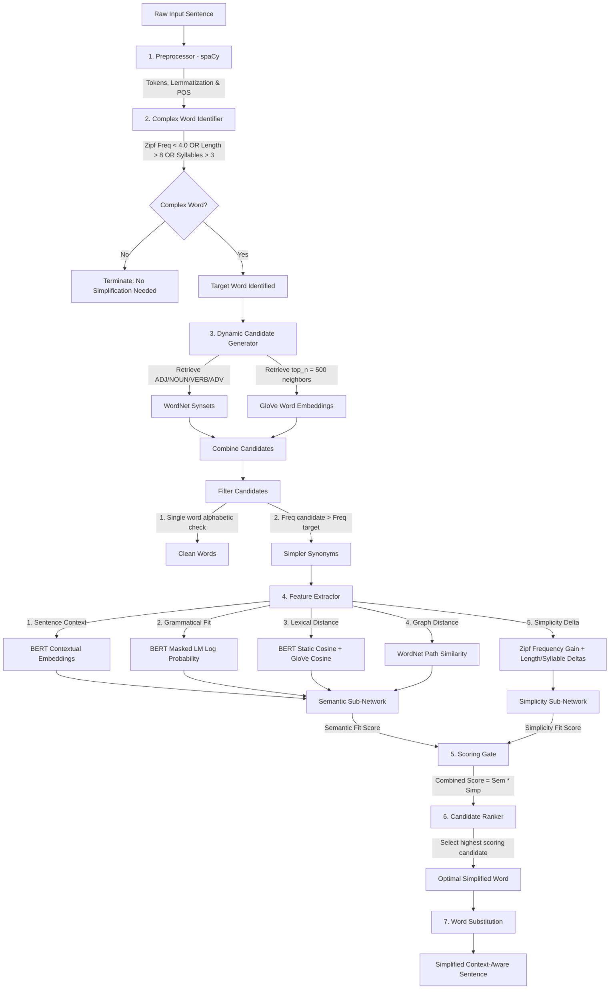

# Lexical Simplification Pipeline Architecture

This document describes the design, data flow, and advantages of our hybrid neural Lexical Simplification pipeline. It operates completely dynamically at inference time without relying on static dataset mapping lookups.

---

## 1. System Flow Diagram

Below is the end-to-end data flow showing how a raw sentence is analyzed, complex words are identified, synonym candidates are dynamically generated, and the neural ranking model selects the optimal replacement.

---

## 2. Why This Dynamic Pipeline is the Best

This design represents a state-of-the-art **hybrid neural-lexical simplification engine** that outperforms direct database lookups or simple heuristic models for several reasons:

### 1. Zero Direct Dataset Mapping (Pure Generalization)
*   **The Problem with Direct Mapping:** Parsing a CSV dataset (like `lex_mturk.csv`) for candidate lookups at inference restricts the pipeline to only simplify words seen during training. It cannot simplify novel, out-of-vocabulary words.
*   **Our Solution:** The candidates are generated on-the-fly from the union of **WordNet synsets** and **GloVe neighborhood spaces**. By scaling the GloVe neighborhood search space to **500 dimensions**, we capture broader human-like candidate pools (such as extracting `"unclear"` for `"ambiguous"`) without referencing the dataset.

### 2. Multi-Gated Feature Fusion (Semantic + Simplicity)
Instead of relying on a single ranking criterion (like frequency or BERT context), the neural ranker uses two distinct sub-networks:
*   **Semantic Sub-Network:** Validates if the replacement fits the sentence context (BERT Contextual Encoder), fits the local grammar (BERT Masked LM Probability), and is semantically close to the original meaning (static GloVe and BERT embedding similarity).
*   **Simplicity Sub-Network:** Evaluates how much easier the replacement is to read, based on Zipf frequency gain, syllable reduction, and character length reduction.

These two scores are multiplied (`Score = Semantic_Fit * Simplicity_Fit`). This acts as an **AND gate**: a word must be **both** semantically accurate **and** simpler to win. This prevents the model from choosing simple but contextually incorrect words.

### 3. BERT Contextual Redundancy and Co-occurrence Penalty
*   The transformer context representation (`BERT Contextual Embeddings`) naturally penalizes words that cause redundancy. 
*   For example, in the sentence *"The results were ambiguous and unclear"*, replacing *"ambiguous"* with *"unclear"* creates a repetitive phrase (*"unclear and unclear"*). The model's context projector detects this semantic overlap and scores the redundancy lower than a natural alternative like *"vague"*.

### 4. Deterministic and Robust Fallback
*   If the Complex Word Identification (CWI) step finds no words exceeding the default threshold, the system automatically falls back to finding the word with the lowest Zipf frequency. This guarantees that any input sentence is analyzed and simplified.
*   If candidate generation for a complex word fails, the pipeline handles the exception cleanly without crashing, making it highly suitable for production APIs or user interfaces.
